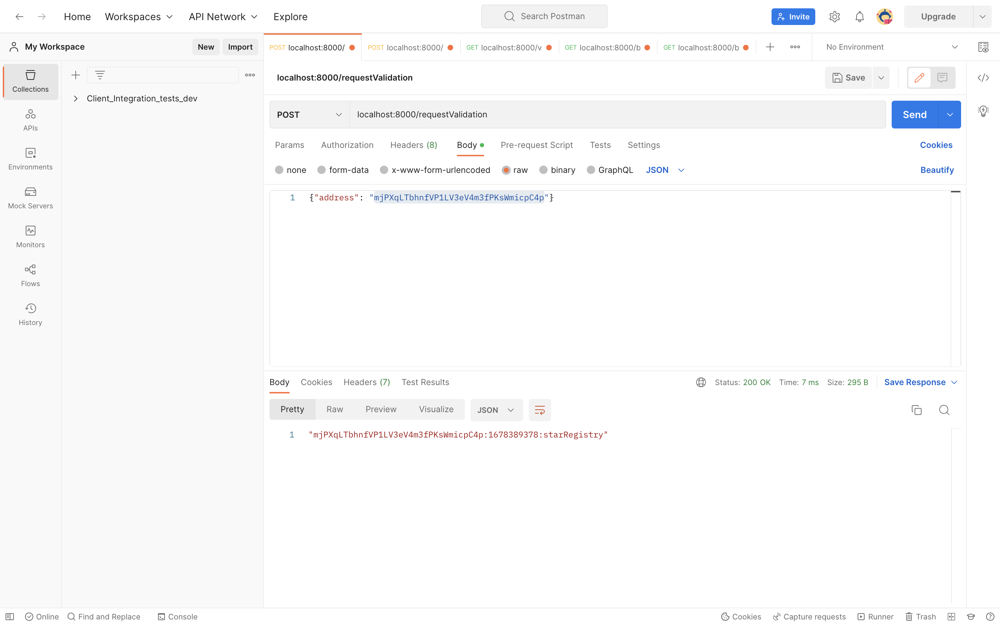
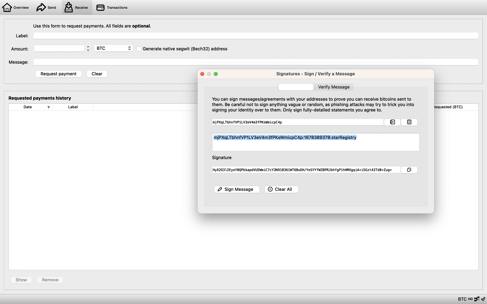
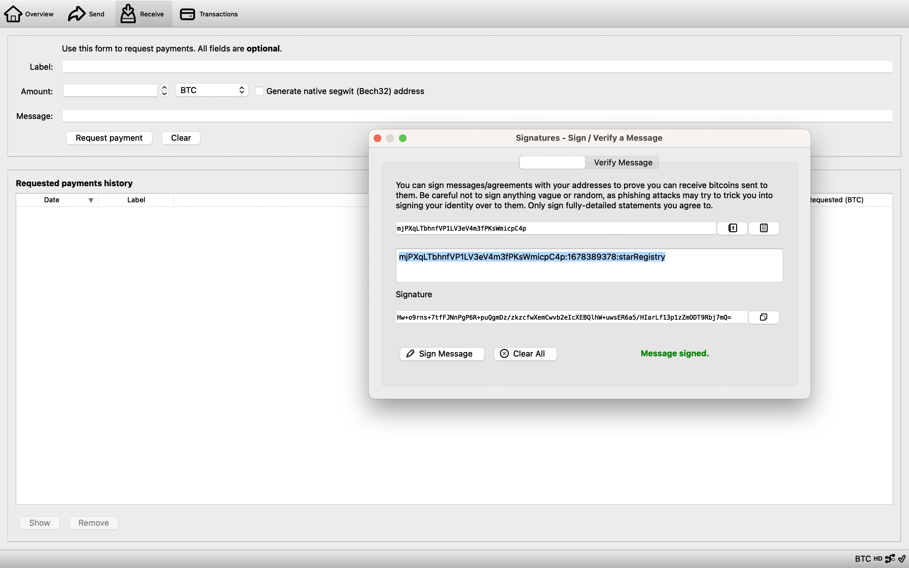
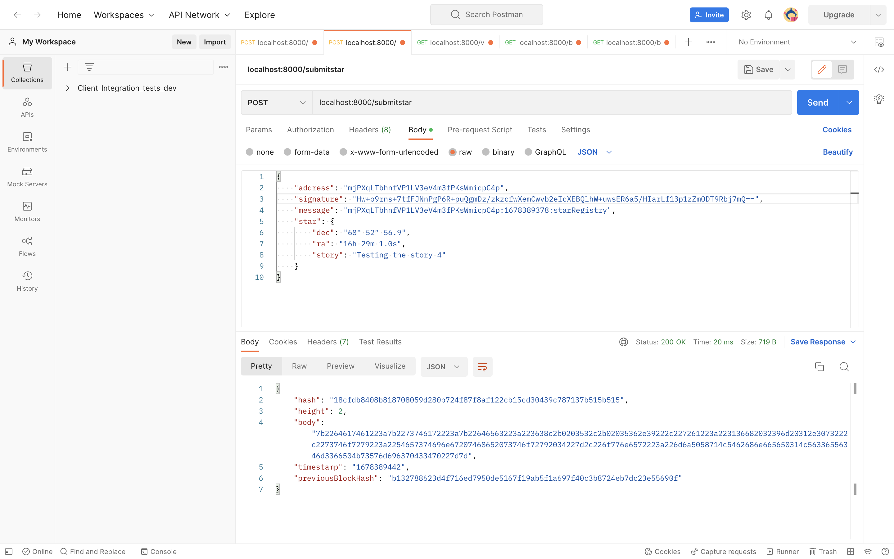
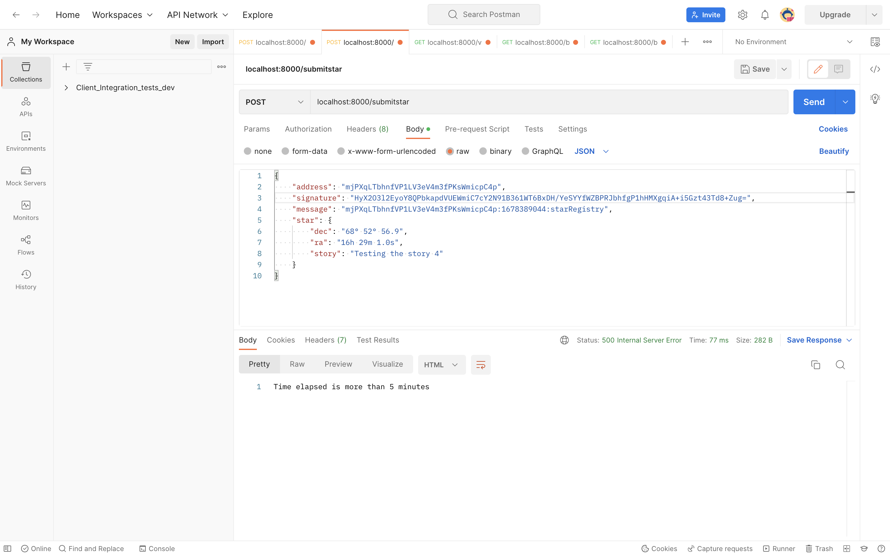
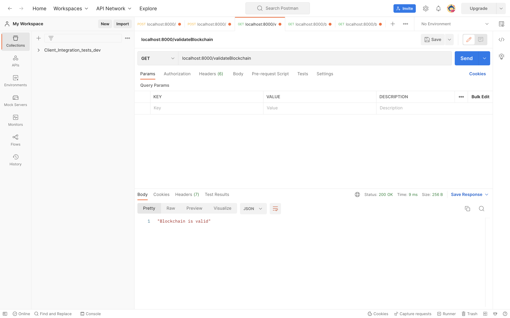
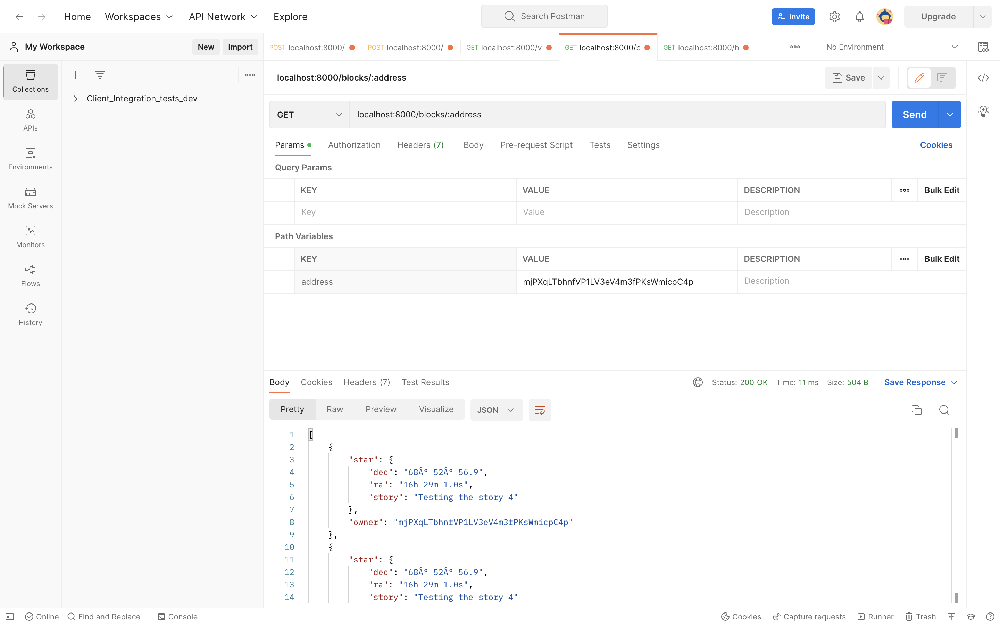
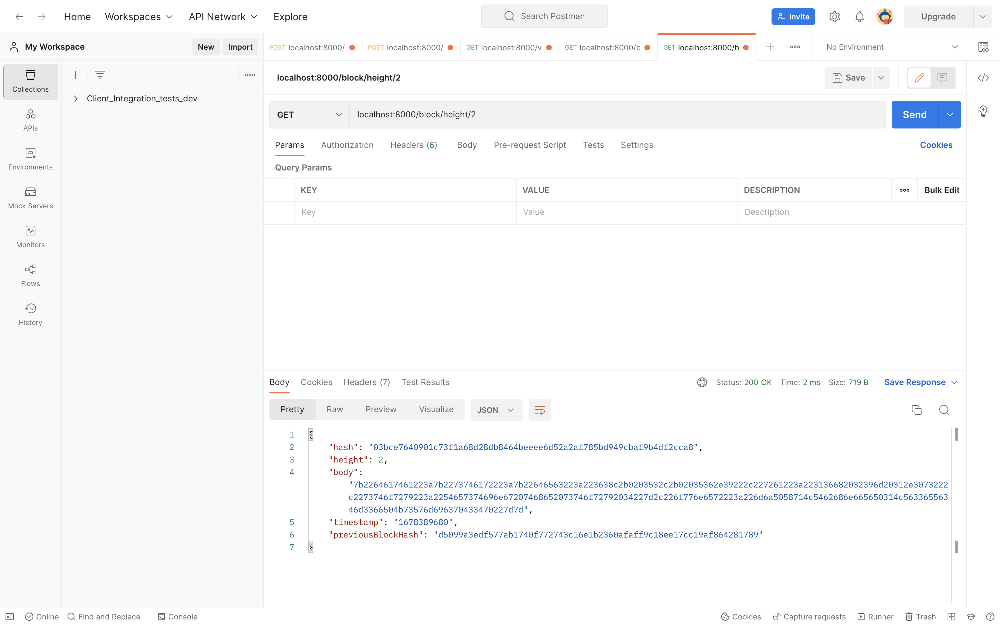
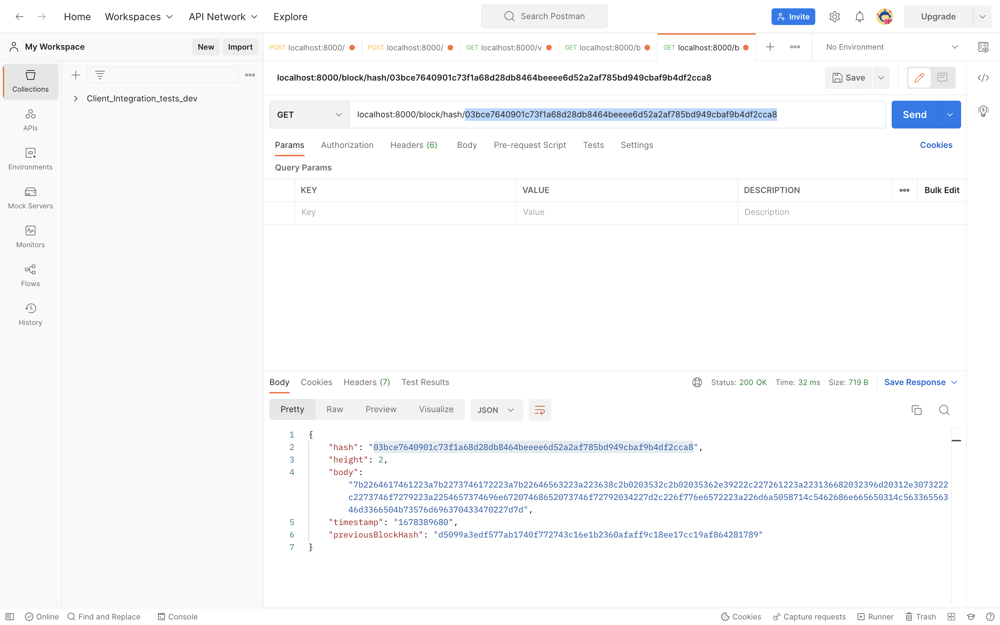

# Star registry blockchain

The application is a part of Udacity Blockchain Development Nanodegree program. This project allowed me to demonstrate my knowledge with the fundamental concepts of a Blockchain platform. Concepts like:
- Block
- Blockchain
- Wallet
- Blockchain Identity
- Proof of Existence
- Digital Assets

## Table of contents

- [Overview](#overview)
  - [The challenge](#the-challenge)
  - [Screenshot](#screenshot)
- [My process](#my-process)
  - [Built with](#built-with)
- [Acknowledgments](#acknowledgments)

## Overview

### The challenge

Users should be able to:

- Request the application to send a message to be signed using a Wallet and in this way verify the ownership over the wallet address.
- Once the user has the message they can use a Wallet (Electrum or Bitcoin Core for example) to sign the message.
- The user will try to submit the Star object. The submission will consist of: wallet address, message, signature and the star object with the star information.
- The application will verify if the time elapsed from the request ownership (the time is contained in the message) and the time when you submit the star is less than 5 minutes.
- If everything is okay the star information will be stored in the block and added to the chain encoding the Star information.
- The application will allow us to retrieve the Star objects belong to an owner (wallet address). This information should be human readable so it shouldn't be encoded.

## My process

### Built with

- JavaScript
- Node.js
- hex2ascii
- bitcoinjs-lib
- crypto-js

## Acknowledgments

This application was created thanks to Udacity providing a Blockchain Nanodegree Program.

### Screenshot

Request ownership message

Sign message

Message signed

Block added

Block not added error

Chain validated

Retrieving author's blocks

Retrieving blocks by height

Retrieving blocks by hash

